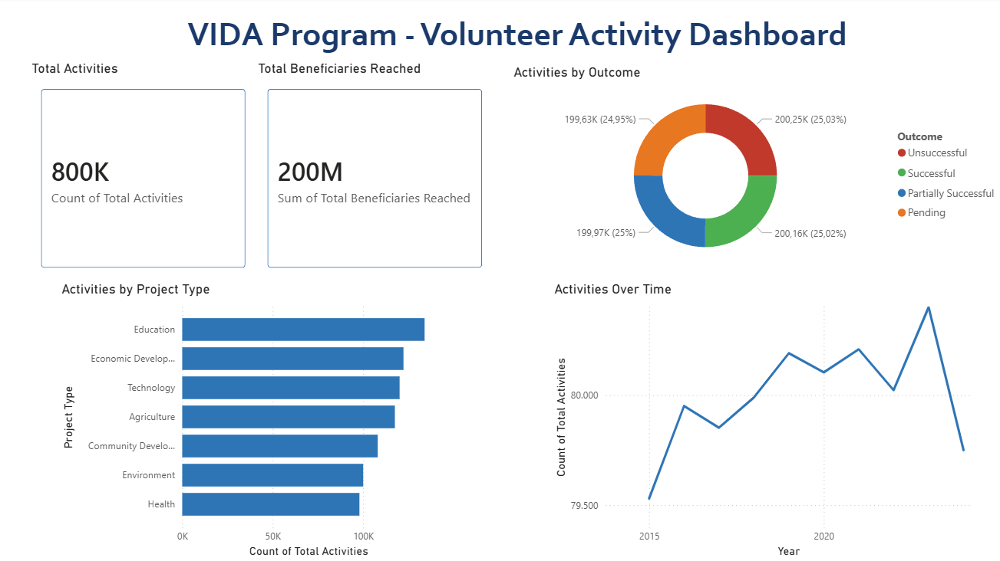

# 🌍 VIDA CRM Lakehouse

A end-to-end Data Engineering project simulating a CRM system for the **Peace Corps VIDA Program** — built with Databricks, Delta Lake, and Medallion Architecture.

---

## 📊 Dashboard Preview

---

## 🏗️ Architecture

This project implements a **Medallion Architecture** (Bronze → Silver → Gold) using:

- **Bronze Layer** — Raw CSV ingestion into Delta Tables
- **Silver Layer** — Data cleaning, type casting, and validation
- **Gold Layer** — Star Schema optimized for analytics

---

## ⚙️ Tech Stack

| Tool | Purpose |
|------|---------|
| Python + Faker | Synthetic data generation |
| Google Colab | Data generation environment |
| Azure Databricks | Data processing and pipeline |
| Apache Spark (PySpark) | Distributed data processing |
| Delta Lake | Storage format (ACID, versioning) |
| Power BI | Dashboard and visualization |
| GitHub | Version control |

---

## 📁 Project Structure

volunteer-crm-lakehouse/
├── data/raw/               # Synthetic CSV datasets
├── notebooks/              # Databricks notebooks
│   ├── 01_bronze_ingestion.ipynb
│   ├── 02_silver_transformation.ipynb
│   └── 03_gold_star_schema.ipynb
├── scripts/                # Python scripts
│   └── 01_synthetic_data_generation.py
├── powerbi/                # Power BI dashboard
│   └── vida_crm_lakehouse.pbix
├── images/                 # Screenshots
└── README.md

---

## 📦 Dataset

Synthetic data generated with Faker simulating a real CRM system:

| Table | Records | Description |
|-------|---------|-------------|
| dim_volunteer | 8,000 | Peace Corps volunteers |
| dim_geography | 250 | Countries and regions |
| dim_organization | 800 | Partner organizations |
| dim_project | 400 | Development projects |
| dim_date | 3,653 | Date dimension (10 years) |
| fact_volunteer_activity | 800,000 | Volunteer activities |

---

## 🚀 How to Run

1. Clone this repo
2. Run `scripts/01_synthetic_data_generation.py` to generate datasets
3. Upload CSVs to Databricks Volume
4. Execute notebooks in order: Bronze → Silver → Gold
5. Connect Power BI to Databricks using the SQL Warehouse endpoint

---

## 👤 Author

**Emmanuel Quesada Gómez**  
Data Engineer 
[GitHub](https://github.com/EmmanuelQuesadaG) | [LinkedIn](https://www.linkedin.com/in/emmanuel-quesada)
